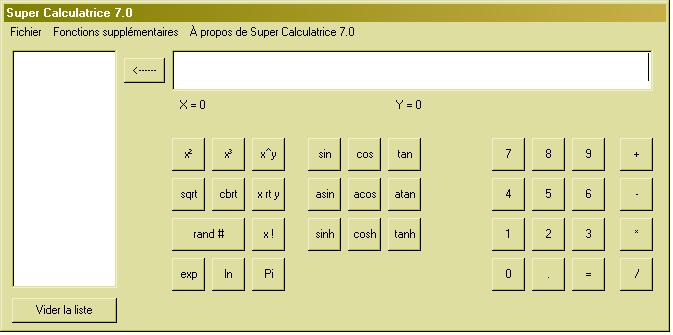



## Calculatrice 7

### Description

A multifuctional calculator with graph plotter please vote for the one who did it also. Full of functions like LCM GCF and many others.
 
### More Info
 
Uses a few math function in dll that you may not have but won't disturb the whole thing if you remove these parts

             |
---                |---
**Submitted On**   |2003-02-11 19:54:24
**By**             |[Ti\_fran](https://github.com/Planet-Source-Code/PSCIndex/blob/master/ByAuthor/ti-fran.md)
**Level**          |Intermediate
**User Rating**    |5.0 (10 globes from 2 users)
**Compatibility**  |VB 6\.0
**Category**       |[Math/ Dates](https://github.com/Planet-Source-Code/PSCIndex/blob/master/ByCategory/math-dates__1-37.md)
**World**          |[Visual Basic](https://github.com/Planet-Source-Code/PSCIndex/blob/master/ByWorld/visual-basic.md)
**Archive File**   |[Calculatri16761811252003\.zip](https://github.com/Planet-Source-Code/ti-fran-calculatrice-7__1-50124/archive/master.zip)

